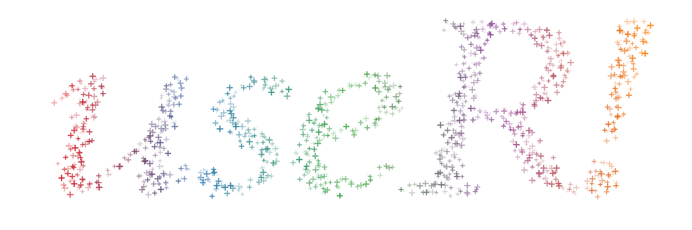

useR! 2014 Design
========================================================

This is some code for creating a nice useR! 2014 design.




```coffee
#create number of repeats
pos <- c(60,13,14,5,60,17,10,5,63,5,5,5,9,5,63,4,7,5,8,5,63,4,8,4,8,4,64,4,8,5,7,4,64,3,10,4,7,4,64,3,10,4,6,4,64,4,10,4,6,4,64,4,10,4,6,4,7,3,11,2,9,5,12,5,10,4,9,4,7,4,6,4,9,3,9,7,9,8,9,3,10,4,7,3,5,6,9,3,7,2,3,4,7,3,4,4,8,3,9,4,8,3,4,2,1,4,9,3,6,2,6,2,6,3,5,4,7,4,9,4,8,3,3,2,2,3,9,4,6,2,13,3,6,4,7,4,8,4,9,2,8,3,9,4,5,3,12,3,7,4,7,4,6,4,11,2,8,3,9,3,6,3,12,3,7,3,8,12,12,3,7,4,9,3,6,4,10,3,7,3,9,12,12,3,7,3,10,3,6,5,9,3,5,4,9,4,5,4,12,2,8,3,9,4,7,6,6,4,3,4,11,4,5,5,11,2,8,3,8,4,9,6,5,9,13,4,6,4,11,2,7,4,8,4,10,6,4,6,16,4,6,4,11,2,7,4,7,5,11,5,4,3,19,3,8,4,19,3,7,6,12,5,3,3,18,4,8,4,19,3,6,2,1,4,13,4,2,4,18,4,8,5,18,3,5,2,2,3,15,3,2,4,18,4,9,5,16,4,4,2,3,3,3,1,11,3,3,4,9,2,6,4,9,5,6,3,7,4,3,2,4,3,2,2,1,3,7,2,4,4,8,2,7,4,10,5,4,5,6,4,2,2,4,7,2,4,5,3,4,5,5,3,7,5,11,4,4,5,6,7,5,6,3,6,2,3,5,11,8,6,11,5,3,5,6,6,6,5,5,8,8,9,6,12,10,5,1,5,7,3,9,2,8,5,12,4,9,12,13,2,1,4,6)
#create 1s and 0s using repeats
d1 <- rep(rep(c(1,0), length.out=length(pos)), times=pos)
#convert to matrix
d2 <- data.frame(matrix(d1,ncol=92, byrow=T))
#get x coord, y coord and z values
yvec<-vector()
xvec<-vector()
zvec<-vector()
for(i in 1:nrow(d2))
{
  for(j in 1:ncol(d2))
  {
    yvec<-c(yvec,i)
    xvec<-c(xvec,j)
    zvec<-c(zvec,d2[i,j])
  }
}

#create dataframe
d3 <- data.frame(x=xvec,y=yvec,z=zvec)
#remove value 1
d4<-subset(d3,d3$z==0)
#jitter coordinates
d4$x <- jitter(d4$x,4,0.5)
d4$y <- jitter(d4$y,4,0.5)
d4$x1 <- jitter(d4$x,4,0.5)
d4$y1 <- jitter(d4$y,4,0.5)
#random size between 1 to 6
d4$size<-sample(1:9,nrow(d4),replace=T)
d4$size1<-sample(9:16,nrow(d4),replace=T)
#random alpha between 0.4 and 1
d4$alpha<-sample(2:4,nrow(d4),replace=T)/10
d4$alpha1<-sample(4:9,nrow(d4),replace=T)/10

#plotting
p<-ggplot()+
  geom_point(data=d4,aes(x=x,y=y,col=x,size=size,alpha=alpha),shape="+")+
  geom_point(data=d4,aes(x=x1,y=y1,col=x,size=size1,alpha=alpha1),shape="+")+
  scale_colour_gradientn(colours= brewer.pal(5,"Set1"),space ="rgb",guide=FALSE)+
  scale_y_reverse()+
  theme_minimal()+
  labs(x="",y="")+
  theme(legend.position="none",axis.text=element_blank(),axis.ticks=element_blank(),panel.grid=element_blank())

#export image #maintain aspect ratio around 1:3
png("useR.png",height=10,width=30,res=200,units="cm",type="cairo")
print(p)
dev.off()
```